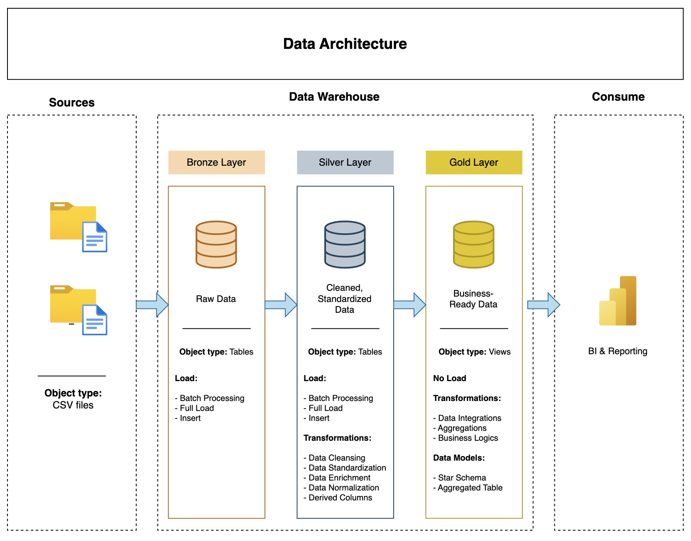

# Data Warehouse and Analytics Project

This portfolio project demonstrates a comprehensive data warehousing and analytics solution, from building a data warehouse to generating actionable business insights.

## Data Architecture

The data architecture for this project follows Medallion Architecture **Bronze**, **Silver**, and **Gold** layers:

1. **Bronze Layer**: Stores raw data as-is from the source systems. Data is ingested from CSV Files into MySQL Database.
2. **Silver Layer**: This layer includes data cleansing, standardization, and normalization processes to prepare data for analysis.
3. **Gold Layer**: Houses business-ready data modelled into a star schema required for reporting and analytics.

## Project Overview

This project involves:

1. **Data Architecture**: Following a Modern Data Warehouse Using Medallion Architecture **Bronze**, **Silver**, and **Gold** layers.
2. **ETL Pipelines**: Extracting, transforming, and loading data from source systems into the warehouse.
3. **Data Modelling**: Developing fact and dimension tables optimized for analytical queries.

## Tech Stack

- **Database**: MySQL  
- **ETL**: SQL Scripts  
- **Modeling**: Star Schema Design  
- **Analytics**: Advanced SQL (joins, window functions, subqueries)

## Acknowledgements

This project structure and methodology were adapted from [DataWithBaraa’s SQL Data Warehouse Project](https://github.com/DataWithBaraa/sql-data-warehouse-project) under the [MIT License](LICENSE).

## About Me

Hi! I’m **Hanson Yang**, an MSBA student at UCLA Anderson, passionate about leveraging data to solve business problems.  
Feel free to [connect with me](https://www.linkedin.com/in/hansony)
